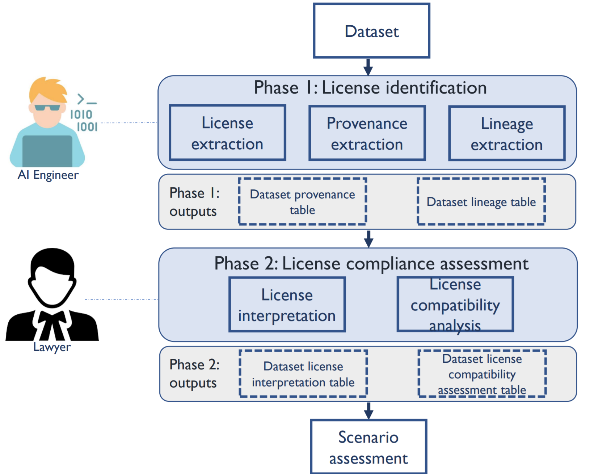
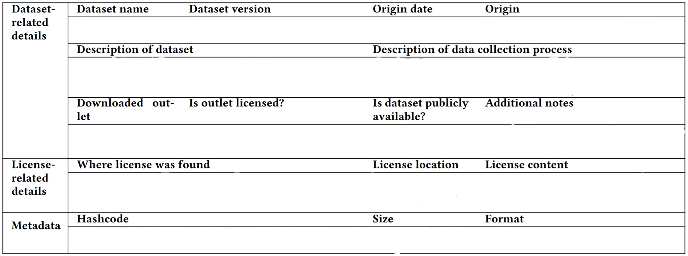
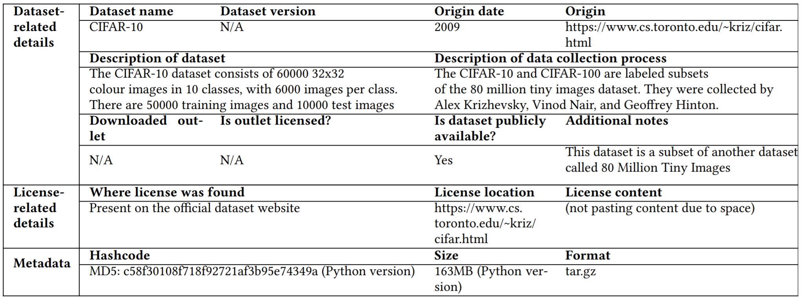
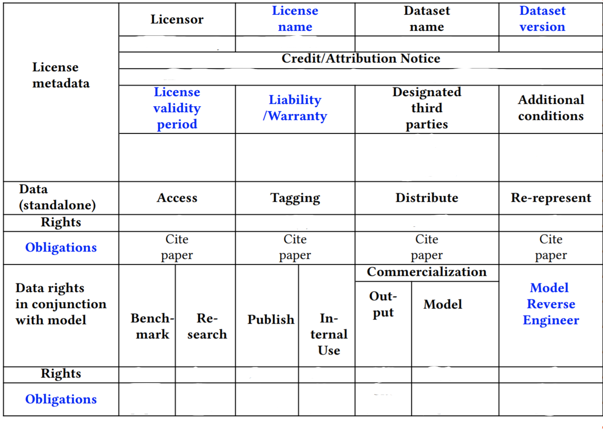
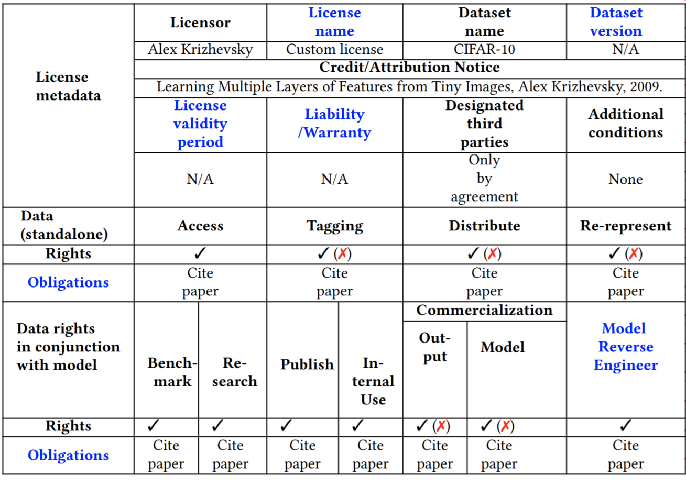

## License compliance analysis -- Overview

Our overall approach for identifying whether using a publicly available dataset to build a commercial AI software would result in a license compliance violation is given below. It starts with an AI Engineer initiating the request for license compliance analysis for a particular dataset. The license compliance analysis approach consists of two phases: 

Phase 1, called **License identification**, involves gathering the information we need about a *dataset's license, provenance* and *lineage*. The output of Phase 1 includes a *Data Provenance Report* and a *Data Lineage Report.*

Phase 2, called License compliance assessment, involves interpreting the output of Phase 1 and then completing a risk assessment based on the findings. Its outputs are Dataset License Interpretation Report and a License Compatibility Report.

Phase 1 can be done by an AI engineers. However, Phase 2 must be done by a lawyer, as interpreting the information contained in the collected licensing information requires legal expertise. Over the course of our approach, various information (e.g., a dataset\'s provenance, lineage) are documented in a database. Once the analysis is complete, the AI Engineer uses final dataset license compatibility assessment table (the final table that is produced from our approach) to ascertain if the given dataset can be used commercially for the usage scenario they are interested in.

It is important to note that when an AI Engineer initiates a request to analyze the license compliance risks associated with a dataset, we first check if we already have conducted the analysis by looking up the results from the previous analyses. Only if we haven\'t analyzed the given dataset before, will we go through our proposed approach. Else, we simply return the stored license compatibility assessment table from the last time we assessed the given dataset.

Our first goal is to first collect the provenance and lineage details of various publicly available datasets through this project using our data provenance and lineage tables. We welcome contributors from community to assist us with collecting a dataset's provenance and lineage. Our next goal is invite contributions from lawyers in the open source community to help us conduct the phase 2 (License compliance assessment) and document these results in a database that is verified by crowdsourced knowledge. Finally, as a future step we will also come up with a moderation process that will help us verify and maintain the veracity of the information collected and stored.

In the remainder of this document, we explain both phases and the steps and sub-steps contained in each phase. As a running example, we demonstrate our data license compliance assessment approach in the context of finding the the license compliance of CIFAR-10 dataset.

**Phase 1: License Identification**

In this phase, an AI engineer identifies all the license details that need to be interpreted for potential license compliance violations.

**Step 1 License extraction.** Unlike OSS source code, dataset licenses are not made available in a standard fashion. Therefore, we first search for the license on the website from which the dataset was downloaded. If we are unable to find a license, we then check if a license is provided as a separate file as part of the dataset. If not, we reach out to the owners of the dataset asking about the dataset\'s license.

**Running example**. We download the CIFAR-10 dataset from its official website. Also on the CIFAR-10 website, we find the following request from the dataset creators: "Please cite if you intend to use this dataset\" alongside a link to the paper. We extract this as the dataset\'s license.

**Step 2 Provenance extraction.** The provenance of a dataset represents the true source of origin of the dataset. A dataset could be first created by some researchers and could later be distributed through different platforms (sometimes even with a different license than the one assigned by the creators). In addition, it is important to verify if the dataset we obtained is indeed the same dataset created by the creators of the dataset. Therefore, it is pivotal to ascertain the provenance of a dataset to verify if the license that we extracted in the previous step is indeed the correct license of the dataset. We do so through the following sub-steps.

**Sub-step 1) Locate official dataset source.** The first task is to locate the official source of the dataset (e.g., official website, research paper, or technical report) by querying search engines with appropriate search terms.

*Running example.* We have already located the official source of CIFAR-10, which we verify through the presence of the accompanying publication.

**Sub-step 2) Extract license and metadata of official source.** We then extract the license and certain metadata about the dataset by collecting the details that we outline in the provenance schema, including the contents of the license that we present below.

Explanation for the terms:

 **Dataset name**: Name of the dataset under consideration

**Dataset version**: Which particular version the information pertains to, if applicable **Origin date**: The time when a dataset first came about, e.g., the time of publication of CIFAR-10\'s technical report

**Origin**: The place where a dataset first came about, e.g., CIFAR-10\'s official website

 **Description of dataset**: Brief overview given by the creators of the dataset, e.g., \"The

CIFAR-10 dataset consists of 60000 32x32 colour images in 10 classes, with 6000 images per class. There are 50000 training images and 10000 test images.\"

**Description of the data collection process**: Details of how the data were collected, as reported by the dataset creators, e.g., \"CIFAR-10 and CIFAR-100 are labeled subsets of the 80 million tiny images dataset. They were collected by Alex Krizhevsky, Vinod Nair, and Geoffrey Hinton.\"

**Downloaded outlet**: If the dataset was downloaded from a different outlet than origin, we record the location

**Is outlet licensed?**: Whether the downloaded outlet is licensed

 **Is the dataset publicly available?**: Whether the dataset is available to the public or is behind a paywall

**Where license was found**: Short description of where license was found, e.g., on official website, with the downloaded dataset, etc.

**License location**: URL or relative path of the license

**License content**: Record the contents of the license

**Hash code**: Any hash code(s) supplied by the dataset creators

**Size**: Size of the dataset download

**Format:** File type of the dataset download

**Additional notes**: Any further details that are relevant to this dataset\'s provenance

For extracting the license, we recommend official websites as the first place to look for the license. Sometimes this requires creating an account. If a license is not found on the official website, then one can download the dataset to see whether the license is packaged with the dataset files.

Once we extract a dataset's provenance, if the license that we extracted in the previous step contradicts the license extracted in this step, we use the license that we extracted through provenance as the dataset's license.

*Running example.* While extracting CIFAR-10\'s provenance, we learn that the authors of the website that hosts the dataset and the authors of the associated publication are the same. As such, we simply collect the dataset\'s provenance details as shown above. In addition, since the license extracted in this and the previous step are consistent, we know the license that we extracted in the previous step is the dataset's license. We present the collected data provenance details here.

**Step 3 Lineage extraction**

A dataset's lineage tracks the data sources from which a given dataset was created. Many publicly available datasets, including computer vision and NLP datasets, are created by collecting data from different sources, which are generally other datasets or popular websites that host or index data points such as images. Not surprisingly, these different data sources typically have a license that is different from that of the dataset but are no less important to verifying the validity of the license of the dataset under examination. It is important to note that if a dataset is completely created from scratch (i.e., not extracted from any data source), then we do not have any lineage details for that dataset.

**Sub-step 1) Trace dataset creation process.** We want to know how a dataset was created, which requires that we trace all of its data sources. The information we need to begin this sub-step is stored in the "Description of the data collection process" field that we recorded when we extracted the dataset's provenance. Then, if we learn that this data source in turn has other data sources, we also record those data sources recursively.

*Running example.* We previously learned through provenance extraction that CIFAR-10 is a subset of another dataset called 80 Million Tiny Images. Reading the research paper associated with 80 Million Tiny Images, we learn that this dataset has 7 data sources: Google, Flickr, Ask, Altavista, Picsearch, Webshots and Cydral. Figure below is a visual representation of CIFAR-10's data sources.

**Sub-step 2 Locate official sources of data sources**. We verify information about the data sources by locating their official sources (e.g., official dataset website, search engine and so on) similar to sub-step 1 of Provenance extraction.

*Running example.* First, we locate the official dataset website for 80 Million Tiny Imagesthrough Google search. After learning that the dataset has been withdrawn, we then locate the archived versions of the website available on the Internet Archive. Following that, we visit the official websites for each of the 7 data sources listed above.

**Sub-step 3 Determine the license range.** A key challenge in determining the correct license of a data source is that a dataset might have been created some time ago. Since then, the license of the data source might have evolved. To mitigate this problem, we identify the license range associated with a given dataset. License range refers to the time period when the data contained in the dataset was likely collected. This, of course, is merely an estimate, but it is important because if a dataset's contents come from a data source (e.g., Google Images), then we need to know which past versions of the data source's license are relevant to the dataset (e.g., Google's Terms of Service from 2005, and/or 2007, and/or 2012, and so on). Only the licenses that were effective during the license range of the dataset are of interest to us.

To determine the end of the license range, we use the *Origin date* field that we collect during the provenance extraction stage, which identifies the year when the dataset first originated. A variety of chronological information about a dataset can be used as a proxy for the origin date, including when the dataset's research paper was first published, when the dataset was first made available as part of a programming challenge, and so on. We consider the year preceding the origin date to be the beginning of the license range. Data sources such as websites and search engines inherit their license ranges from the dataset to which they contribute content. However, the license range for data sources that are datasets themselves is based on the dataset\'s origin date.

*Running example.* During provenance extraction, we learn that publication year for CIFAR-10 is 2009. which we determine to be the Origin date. So we set the license range to be 2008 - 2009. Its top-level data source, 80 Million Tiny Images, was created in 2006. So its license range is 2005 - 2006. Then, the 7 data sources of 80 Million Tiny Images inherit the same licensing range as their parent dataset, 80 Million Tiny Images.

**Sub-step 4 Identify license for data sources**. Using a Web archive, we collect the earliest available license of each data source during the license range. We do this recursively until we identify the license associated with all the data sources that contributed to the creation of the dataset under consideration. Along with the licenses, for each data source, we collect the provenance details that we outline in the provenance section. We use a web archive because, the license as it appeared when the dataset was first released is the one that applies.

*Running example.* No license captures were available during the license range for CIFAR-10 and for two of its data sources (Ask and Webshots), so we simply store the earliest captures we can find. The license content of 80 Million Tiny Images and Cydral is completely unavailable, and so, we store \\textit{N/A}. For the remaining data sources, we record the earliest license captures from the correct license range and its provenance details. For each of the data source we record its provenance details similar the provenance that we show earlier. For CIFAR-10, we would record the provenance of 7 data sources. To assist with tracing the lineage for each of the data source, we record the following details too.

 **Dataset/data source name**: Name of the dataset or data source under consideration

**Is there another data source?**: Whether this dataset or data source has a data source **License**: Hyperlink(s) to any relevant license information (e.g., information provided on official dataset website, Terms of Use, Creative Commons, etc.)

**License range**: The time period during which license information is collected; calculated to be the year preceding the origin date

**Moderation details.**

To ensure that the collected provenance and lineage information is valid, before storing it, we need to moderate it. The moderation details are TBD.

**Phase 2: License compliance assessment.** Once an AI engineer identifies the license associated with a dataset and the licenses of the data sources that were used to create the dataset, a lawyer decomposes each license to identify the rights and obligations it outlines.

Step 1) License interpretation. The first step of Phase 2 requires a lawyer to read the license associated with the dataset and the licenses of the data sources from which the data were collected. For each license, the lawyer then extracts the rights and obligations outlined in it.

In order to ensure that the extracted rights and obligations are documented in a standard format that facilitates understanding, we document them using a modified version of the Montreal Data License (MDL) proposed by Benjamin\~et\~al. The reason is because MDL standardizes and documents what rights are granted to the dataset itself (e.g., modify, distribute) and what rights are granted to the dataset in conjunction with AI software (e.g., train, research). These rights can be directly linked to the usage scenarios. For example, if the dataset license grants rights to distribute the dataset, then the usage scenario of distributing the dataset will be permissible. The MDL was originally proposed to create licenses for sharing new datasets. However, for this work, we re-purpose the MDL format to document the legal interpretations associated with datasets (i.e., to decompose licenses into their rights and obligations) and identify the usage scenarios that are acceptable. We further enhance MDL in the following four aspects:

-   The MDL does not record the obligations that the user of a dataset needs to fulfil when enjoying a specific right. %For instance, while the MDL records if the dataset can be distributed or not, it does not record if there are any obligations (e.g., to share it with the same license) when enjoying the given right. Therefore, we enhance the MDL by capturing both rights and obligations for all fields in *Rights to dataset* and *Rights to dataset in conjunction with AI models*.

-   When recording Rights to dataset in conjunction with AI models, the MDL does not capture if the license allows reverse engineering the trained AI model to reconstruct the data. As such, we add a new field \`\`Model reverse engineer\'\' to record this.

-   We add fields to record license validity period and the liability or warranty provided by the license.

We call our modified MDL documentation schema the Enhanced MDL. We provide the schema and a description of each field in our schema below.

**Dataset/data source name**: Name of the dataset/data source under consideration **Dataset version**: Which particular version the information pertains to, if applicable **Licensor**: The owner of the dataset/data source who assigned the license

**License name**: Name of the license if it is a standard license (e.g., CC-SA); fill in "custom" otherwise

 **Credit/Attribution notice**: When using the dataset if credit/attribution needs to be given, who should it be given to

 **License validity period**: Records the expiry date of the license

**Liability/Warranty**: Records the warranty/liability specified in the license (we specify N/A if there are no warranties specified in the license)

**Designated third parties**: The designated third parties that the license specifies as entities that can modify the license (N/A if none specified)

 **Access rights (data):** Right to view or download the data for the purpose of evaluation **Access obligations (data)**: Obligations to fulfill when viewing or downloading the data for the purpose of evaluation

 **Tagging rights (data)**: Right to add tags or labels to the data (or any portion thereof)

**Tagging obligations (data)**: Obligations to fulfill when adding tags or labels to the data (or any portion thereof)

 **Distribute rights (data)**: Right to make the data (or any portion thereof) available to third parties

 **Distribute obligations (data)**: Obligations to fulfill when making the data (or any portion thereof) available to third parties

**Re-represent rights (data)**: Right to alter the data such that there exists an alternative version that can used in lieu of the original

**Re-represent obligations (data)**: Obligations to fulfill when altering the data such that there exists an alternative version that can used in lieu of the original

**Benchmark rights (data with model)**: Right to use the data to assess the performance of different untrained models; the trained model, however, can only be used to demonstrate the results of the training

**Benchmark obligations (data with model)**: Obligations to fulfill when using the data to assess the performance of different untrained models; the trained model, however, can only be used to demonstrate the results of the training

 **Research rights (data with model)**: Right to use the data to train a model; the trained model and its output, however, are restricted to research use only

 **Research obligations (data with model)**: Obligations to fulfill when using the data to train a model; the trained model and its output, however, are restricted to research use only **Publish rights (data with model)**: Right to train a model that is available to third parties for research or publication only

 **Publish obligations (data with model)**: Obligations to fulfill when training a model that is available to third parties for research or publication only

**Internal use rights (data with model)**: Right to use the data to train a model and improve its output; however, neither the trained model nor its output can be commercialized or made available for third party use or benefit

**Internal use obligations (data with model)**: Obligations to fulfill when using the data to train a model and improve its output; however, neither the trained model nor its output can be commercialized or made available for third party use or benefit

**Output commercialization rights (data with model**): Right to use the data to train a model and improve its output. The output can then be commercialized and made available for third party use or benefit; however, the trained model cannot be made available

**Output commercialization obligations (data with model)**: Obligations to fulfill when using the data to train a model and improve its output. The output can then be commercialized and made available for third party use or benefit; however, the trained model cannot be made available

 **Model commercialization rights (data with model)**: Right to make a trained model or any product or service utilizing a trained model available to third parties. The model\'s output may or may not be available to the same third party

**Model commercialization obligations (data with model)**: Obligations to fulfill when making a trained model or any product or service utilizing a trained model available to third parties. The model\'s output may or may not be available to the same third party

 **Model reverse engineer rights (data with model)**: Right to reverse engineer a trained model to reconstruct the dataset used for its training

 **Model reverse engineer obligations (data with model)**: Obligations to fulfill when reverse engineering a trained model to reconstruct the dataset used for its training

**Additional conditions**: Records any additional conditions if specified in the license of the given dataset

In this step, we provide a Enhanced MDL decomposition for the dataset under consideration and all the data sources pertaining to the dataset that we identified in the lineage extraction step.

*Running example.* The main results of our decomposition can be given as follows. The fields marked in blue represent our enhancement. In summary, a user has rights to access the CIFAR-10 data for every use case outlined in the schema. To do so, the user is required to cite the associated technical report, as requested on the official dataset website.

**Optional sub-step Documentation and schema update.** In the event that one needs to ascertain if a new usage scenario other than the ones that are dictated by the rights that our enhanced MDL schema captures, then they should enhance our schema. They can do so by adding a column to capture the rights and obligations that would pertain to their usage scenario. If they think the additional schema can be universally useful, we encourage them to submit a pull request.

*Running example.* In case we wanted to understand if we could build adversarial models with the given dataset, we would enhance our schema to include rights and obligations required to use the dataset to build an adversarial model.

**Step 2 License compatibility analysis.** Based on the well formatted information of the Enhanced MDL, a risk assessment is performed to decide whether the dataset should be used in the commercial context for which it is being considered. The risk assessment, which involves interpreting the compatibility between multiple legal licenses, advises practitioners on what rights they can enjoy commercially and what obligations they have to satisfy to do so. These rights in turn inform the practitioners what usage scenarios they can use the dataset for, and what are the obligations that they need to fulfil to do so.

Before assessing the usage scenarios that are permitted, we need to ascertain the final rights and obligations that are associated with the given dataset after taking the licenses of the data sources into consideration. To reconcile the rights and obligations of using a dataset, we need to match use cases across the different interpreted licenses we have collected. We employ the following heuristics:

-   If a dataset license and all its data source licenses agree that a use case is allowed, then the action is permitted. This permission is reflected in the verified license.

-   If the license of any data source restricts a use case then, even if the main dataset license allows it, the verified license records this discrepancy by marking the action as not permitted.

Essentially, we aim to verify if the rights and obligations of the data sources allow for the dataset license to be valid. For instance, a very permissive dataset license cannot be valid if one of the data sources has a more restrictive license, since the license of the dataset would no longer respect the license under which it obtained the data. Our approach ends with this step after producing the license compatibility analysis table.

*Running example.* For CIFAR-10, there are large discrepancies between what the dataset license allows and what the data source licenses allow. The Table presented below shows the final rights that have changed after the license compatibility analysis in red. *Tagging* under *Rights to Data* is restricted by the license of several data sources of CIFAR-10 including Google and Flickr's licenses and, as such, is not permitted in the verified license (as indicated by the red cross in Table). In summary, we find that even though CIFAR-10\'s license allows all rights to the dataset (even commercial) as long as the paper is cited, the licenses of its data sources are more restrictive, creating potential risks of license compliance violation if the dataset is used for any commercial purposes including training an AI model, or modifying or distributing the dataset.

**Moderation details.**

**TBD**

**Scenario assessment.** Using the rights allowed in the previous step as given by the final license compatibility assessment analysis table, we determine if the given dataset can be used for the required commercial usage scenario (e.g., to embed a model trained on the given dataset in a commercial product). If the rights permit the usage scenario, we convert the obligations to AI software requirements and make it a part of the AI software development life cycle so that it can be continuously traced, documented and tested.

**Running example.** If we want to check if the usage scenario of commercializing the model constructed using CIFAR-10 is allowed, we check if the model commercialization rights are present and what are its associated obligations. From Table we find that model commercialization rights are not present, hence the usage scenario of commercializing the model trained on CIFAR-10 will not be permissible.
